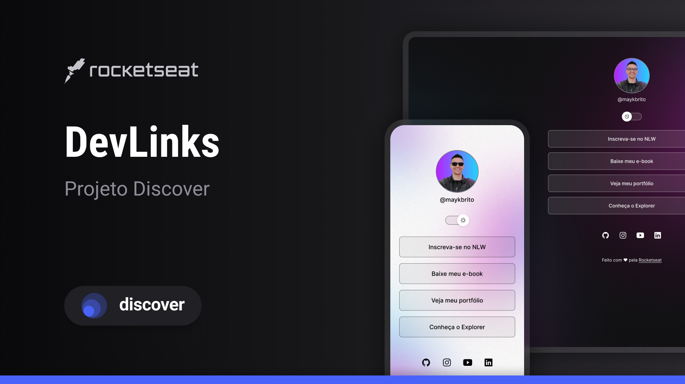

  

## 💻 Projeto
DevLinks é um agregador de links para usar como cartão de visitas online.

## 🚀 Tecnologias
Esse projeto foi desenvolvido durante a trilha  **Discover** da Rocketseat utilizando as seguintes tecnologias:

- HTML e CSS
- Javascript
- Git e Github
- Figma

## 🏷️ Layout
Você pode vizualizar o layout do projeto através [desse link](https://www.figma.com/community/file/1187422022288947321). É necessário ter uma conta no [Figma](https://www.figma.com) para acessá-lo.